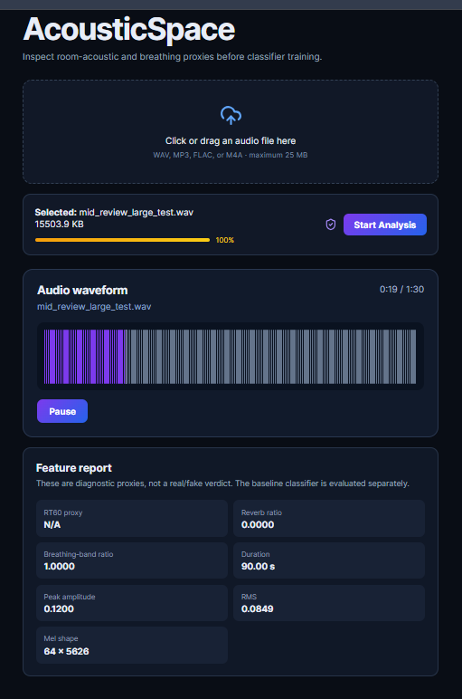

# AcousticSpace — Mid-Project Validation

## Review scope

The mid-project review validates acoustic feature extraction, baseline CNN performance, large-audio upload handling and waveform rendering.

## Acoustic extraction validation

Controlled synthetic signals were used to test the acoustic proxies.

### RT60 validation

Two exponential room-decay signals were generated:

- Small-room target RT60: 0.30 seconds.
- Large-room target RT60: 0.90 seconds.

The estimated RT60 increased with the known decay time, confirming that the proxy responds to different reverberation conditions.

### Breathing-band validation

| Test signal | Breathing-band ratio |
|---|---:|
| Quiet 250 Hz signal | 0.9999 |
| Quiet 2000 Hz control | 0.0000 |

This confirms that the proxy focuses on 100–500 Hz energy during quiet audio frames.

### Automated tests

Test result: **12 passed with 3 non-failing dependency warnings.**

## Baseline CNN validation

The baseline CNN was evaluated on all 71,237 ASVspoof 2019 LA evaluation recordings.

| Metric | Result |
|---|---:|
| Accuracy | 90.16% |
| Precision | 90.25% |
| Recall | 99.81% |
| F1 score | 94.79% |
| Equal Error Rate | 9.00% |

## Frontend architecture check

| Property | Result |
|---|---|
| Test file | `mid_review_large_test.wav` |
| File size | 15.14 MB |
| Duration | 90 seconds |
| Upload limit | 25 MB |
| Waveform rendering | Passed |
| Play/pause controls | Passed |
| Feature extraction | Passed |
| FastAPI response | HTTP 200 |

The dashboard rendered the complete waveform, displayed playback progress and returned the acoustic feature report.

## Evidence boundary

AcousticSpace currently calculates RT60, temporal-decay and breathing-band proxies. The controlled tests show that these features respond to expected acoustic conditions.

They do not claim that a true physical room impulse response can be completely isolated from every arbitrary speech recording. Advanced mismatch classification remains planned for Week 3.

## Conclusion

The Week 1 and Week 2 architecture successfully passed the mid-project checks:

- FastAPI feature extraction is operational.
- Controlled acoustic validation passes.
- The baseline CNN has been trained and evaluated.
- Large-file upload and waveform rendering work.
- Backend tests and frontend verification pass.